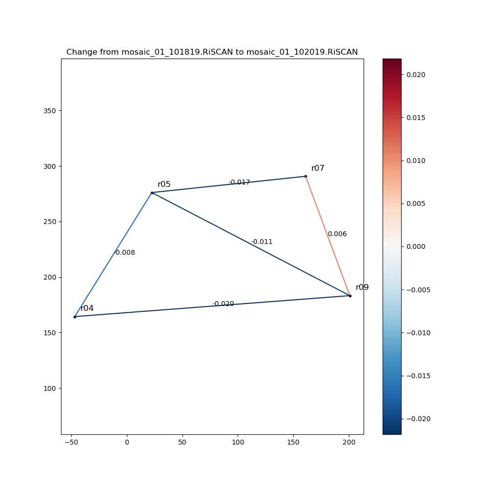

# Processing repeat terrestrial laser scans with pydar

This package contains a set of classes and methods for classifying, filtering, and aligning repeat Terrestrial Laser Scanning (TLS) data, converting pointclouds to irregular or gridded surfaces, and visualizing and interacting with these data. The code was designed for sea ice with an ice fixed, lagrangian reference frame. However, it may be applied to terrestrial data as well and future updates may add georeferencing capabilities. The code has exclusively been developed and tested for a Riegl VZ1000 scanner although it should be adaptable to other terrestrial scanners.

## Installation instructions
0. Get the code:  this repository, or, if you are planning to do code development, fork and then clone it.
1. Create python environment(s):  is recommended for package management. Yaml files of the environments that work on Ubuntu are provided for reference although frustratingly they do not seem to work cross-platform. If the yaml file does not work, to create the 'vtk_processing' environment, go to the root of the pydar directory and run:

    conda create -n vtk_processing numpy matplotlib scipy pandas vtk scikit-learn cython pdal open3d opencv -c conda-forge -c open3d-admin

If you need to use point cloud local maxima functionality install  in that conda environment with pip.

If you need to use the gaussian process surface creation, install pytorch and gpytorch in the environment using conda. On Ubuntu, I encountered unresolvable conflicts when attempting to install pytorch and gpytorch in the same virtual environment as opencv, pdal, and open3d. If you encounter the same issues, you may need to create a separate environment with pytorch and gpytorch in it (see 'vtk_gpytorch.yaml' file). The problem doesn't appear to emerge consistently across platforms however.

Below is a non-exhaustive guide to processing and examining repeat TLS data using pydar

Terminology:

+ Scan Position: set-up the tripod at a given location and measure the topography within the scanner's line of sight.
+ SingleScan: the data collected from a single scan position. We use this term to refer to both the point cloud of topographic measurements from this scan position and ancillary data such as the locations of TLS reflectors within the scanner's reference frame at this scan position and the rigid transformations that register and align this SingleScan with others (see below).
+ Project: a collection of SingleScans covering a contiguous area that were collected during a sufficiently short time interval such that no topographic change occurred between scan positions (ideally, exceptions are described in the Usage Notes). Typically, the set of SingleScans in a Project were collected in a single day of measurements although on some occasions measurements were collected over two days.
+ Registration: the act of computing the rigid transformations that describe the spatial relationships between the different SingleScans in a Project. Registration places all SingleScans in a Project into a common reference frame (whose origin and unit vectors are typically defined by an arbitrary SingleScan).
+ Scan Area: a region of ice whose topography we measured over time with a succession of Projects.
+ Alignment: the act of computing the rigid transformations such that SingleScans from different Projects in the same Scan Area are in a common reference frame. Alignment is necessary to precisely locate topographic changes (e.g., how much snow accumulation occurred at specific location on the ice from 4 January to 11 March).

## Part 0: Prepare and export data from RiSCAN
0. Register scan positions together via standard RiSCAN processing: First, an arbitrary SingleScan is chosen to be the origin of the Project. This SingleScan is levelled using the VZ1000's onboard inclination sensors (right-click SOP, click calculate from inclination sensors). Next, another SingleScan is registered to the first by computing the rigid transformation that minimizes the sum of the least-squares error in the positions of pairs of reflectors (a.k.a. 'keypoints') observed in both SingleScans (in TiePointList, click Find Corresponding Points and check already registered scans). Repeat this process until all SingleScans in the Project are registered. Finally, refine the registration of each SingleScan except for the origin with RiSCAN's 'Multi-Station Adjustment'. In this process, meter-scale planar facets are extracted from each SingleScan. Then, pairs of overlapping facets and pair of reflectors between the SingleScans are all used as keypoints and an optimization procedure adjusted the rigid transformations of each SingleScan (except the origin) in order to minimize the sum of the least-squares error between all keypoints.
1. Label reflectors. In the TPL (PRCS) rename tiepoints such that the reflectors have consistent names from project to project. I.e. 'r01' refers to the same physical point in space in all projects at a particular scanarea.
2. Export all scans as LAS 1.4 files. Create a directory within the project directory named 'lasfiles'. In RiSCAN, right click on a scan and click 'Export'. In the popup menu, click back and select (ctrl+click) all of the single scans. Make sure combine data is not checked. Scans should be exported in the Scanners Own Coordinate System (SOCS). Browse to the 'lasfiles' directory that you created and export scans. A las file should be generated for each singlescan.
3. Export project tiepoints. Click 'Export tiepoints' option in the TPL (PRCS). Name the file 'tiepoints.csv' and place it in the project directory.
4. Export SOP matrices. Under 'Registration' tab, go to 'Bulk SOP export'. Export all SOP matrices as '.DAT' files in the project directory.

## Part 1: Loading and displaying a project in pydar
The following script shows a basic example of how to read in a project and display it in an interactive window.

    import pydar
    
    # Import project
    project_path = '/media/thayer/Data/mosaic_lidar/Snow1/'
    project_name = 'mosaic_01_101819.RiSCAN'
    project = pydar.Project(project_path, project_name, import_mode='import_las')

    # Apply SOP transform to all SingleScans
    project.apply_transforms(['sop'])
    
    # Display
    z_min = -3.5
    z_max = -1.5
    project.display_project(z_min, z_max)

## Part 2: Filtering wind-blown snow particles
These tools are components of the  filter. For more details see Clemens-Sewall et al 2022:

    @article{clemens-sewall_flakeout_2022,
        title = {{FlakeOut}: {A} geometric approach to remove wind-blown snow from terrestrial laser scans},
        volume = {201},
        issn = {0165-232X},
        shorttitle = {{FlakeOut}},
        url = {https://www.sciencedirect.com/science/article/pii/S0165232X22001306},
        doi = {10.1016/j.coldregions.2022.103611},
        abstract = {Wind-blown snow particles often contaminate Terrestrial Laser Scanning (TLS) data of snow covered terrain. However, common filtering techniques fail to filter wind-blown snow and incorrectly filter data from the true surface due to the spatial distribution of wind-blown snow and the TLS scanning geometry. We present FlakeOut, a filter designed specifically to filter wind-blown snowflakes from TLS data. A key aspect of FlakeOut is a low false positive rate of 2.8x10-4—an order of magnitude lower than standard filtering techniques—which greatly reduces the number of true ground points that are incorrectly removed. This low false positive rate makes FlakeOut appropriate for applications requiring quantitative measurements of the snow surface in light to moderate blowing snow conditions. Additionally, we provide mathematical and software tools to efficiently estimate the false positive rate of filters applied for the purpose of removing erroneous data points that occur very infrequently in a dataset.},
        language = {en},
        urldate = {2022-10-02},
        journal = {Cold Regions Science and Technology},
        author = {Clemens-Sewall, David and Parno, Matthew and Perovich, Don and Polashenski, Chris and Raphael, Ian A.},
        month = sep,
        year = {2022},
        keywords = {Sea ice, Snow, Importance sampling, LiDAR, Point cloud filtering, Terrestrial laser scanning},
        pages = {103611},
    }

### The following script demonstrates applying a simple visibility based filter to label points that are disconnected from other points (i.e. floating in space).

    import pydar
    
    project_name = 'mosaic_01_101819.RiSCAN'
    project_path = '/media/thayer/Data/mosaic_lidar/Snow1/'
    
    # Import project
    project = pydar.Project(project_path, project_name, import_mode='import_las')

    # Apply SOP transform to all SingleScans
    project.apply_transforms(['sop'])
    
    # Apply returnindex filter 
    # (aka filter points that are visibly isolated in space)
    radial_precision=0.005
    project.apply_snowflake_filter_returnindex(radial_precision=radial_precision)
    
    # By default we filter out snowflakes, so if we want to display them we
    # need to reset the classes we filter out
    for scan_name in project.scan_dict.keys():
        project.scan_dict[scan_name].update_current_filter('all')
    
    # Display, note now we are displaying by classification and the z_* are
    # superfluous
    z_min = -3.5
    z_max = -1.5
    project.display_project(z_min, z_max, field='Classification')

### FlakeOut also includes local outlier filtering and elevation thresholding

Continuing the script from above:

    # Apply elevation and local outlier filtering
    z_max = 1.5 # max height in project reference frame
    leafsize = 100
    z_std_mult = 3.5
    
    # Apply the filter to each SingleScan
    for scan_name in project.scan_dict:
        ss = project.scan_dict[scan_name]
        ss.apply_elevation_filter(z_max)
        ss.apply_rmin_filter()
        ss.apply_snowflake_filter_3(z_std_mult, leafsize)
    
    # Display
    project.display_project(z_min, z_max, field='Classification')

## Part 3: Writing filtered data to files

Reading and writing LAS files is slow, and the filtering takes a while. For convenience we can write to and read from .npy files. By default we store the processed data in a subdirectory of the Project directory named 'npyfilesSUFFIX' where SUFFIX is set by the user (e.g., '\_archive'). Within the npyfiles subdirectories there are subdirectories for each SingleScan (e.g., 'ScanPos001'). These subdirectories contain numpy files for the point locations in the Scanner's Own Coordinate System ('Points.npy') and each data attribute (e.g., 'Reflectance.npy', 'Classification.npy', etc...).

Writing to npyfiles can be done at the Project or SingleScan level:

    project.write_scans(...)
    ss.write_scan(...)

## Part 4: Align Projects into same reference frame

For reflector alignment, label each reflector with a consistent name (e.g. ‘r01’) in RiSCAN (Part 0 above). Ice deformation and errors in the VZ1000's reflector search process can shift a reflector relative to the other reflectors. The pairwise distances between reflectors can be compared using `ScanArea.compare_reflectors`. We recommend using only the set of reflectors whose pairwise distances between Projects changed by 0.02 m or less. With this set of reflectors as keypoints, compute the rigid transformation that minimizes the least-squares error between the keypoints (implemented in `TiePointList.calc\_transformation`). The default version of this rigid transformation calculation (`mode='LS'` in `TiePointList.calc\_transformation`) requires at least 3 pairs of keypoints and has six degrees of freedom: translations in the 3 spatial directions and rotations around the 3 unit vectors (roll, pitch, and yaw). However, sometimes when there are just 3 or 4 pairs of keypoints, small vertical errors in the reflector positions produce unrealistic tilts (i.e., unreasonable roll and pitch). For these cases and when there are only 2 pairs of keypoints, calculate the rigid transformation without permitting tilt changes (`mode='Yaw'` in `TiePointList.calc\_transformation`).

    import pydar
    
    # Load ScanArea
    project_names = ['mosaic_01_101819.RiSCAN',
                     'mosaic_01_102019.RiSCAN',
                     ]
    project_path = '/media/thayer/Data/mosaic_lidar/Snow1/'
    # Note we use import_mode='empty' to not actually load the scan data
    scan_area = pydar.ScanArea(project_path, project_names, import_mode='empty')
    
    # Compare reflectors
    scan_area.compare_reflectors(project_names[0], project_names[1],
                                 delaunay=True)

The figure produced by `compare_reflectors`:

All four reflectors are within the 0.02 m tolerance, because there are only 4, we will use yaw mode for aligning. Here is one way to do the alignment

    # Named tuple provides specifications for alignment
    # Unfortunately this is currently named Registration may change to alignment
    # in future.
    
    from collections import namedtuple
    
    Registration = namedtuple('Registration', ['project_name_0', 'project_name_1',
                                               'reflector_list', 'mode', 
                                               'yaw_angle'], 
                              defaults=[None, None, None])
    
    # A registration tuple that is just the same scan area indicates that this
    # is the PRCS all other Projects will be aligned into
    scan_area.add_registration_tuple(Registration('mosaic_01_101819.RiSCAN', 
                                                  'mosaic_01_101819.RiSCAN'))
    # This tuple specifies which scans to align and which reflectors to use
    scan_area.add_registration_tuple(Registration('mosaic_01_101819.RiSCAN',
                                                  'mosaic_01_102019.RiSCAN',
                                                  ['r04', 'r05', 'r07', 'r09'],
                                                  'Yaw'))
    # register_all executes the reflector alignment specified by the tuples
    scan_area.register_all()

This will update the transform applied to each SingleScan

## Part 5: Writing and reading alignment (transformations) from files

For convenience and to avoid needing to recompute the transformations, the rigid transformation aligning each SingleScan can be written out to a '.npy' file that can be loaded directly. In the Project's directory, there is a subdirectory named 'transforms', within which there are subdirectories for each SingleScan (e.g., 'ScanPos001'). The default is to write the current transforms into this subdirectory and name it 'current\_transform.npy'. After loading the transform, it will now be named 'current_transform' (or whatever it was named) when applying it in methods (e.g. `apply_transforms`).

Transforms can be written and read at the SingleScan level e.g.:

    ss.write_current_transform()
    ss.read_transform()

Or at the Project level e.g.:

    project.write_current_transforms()
    project.read_transforms()

